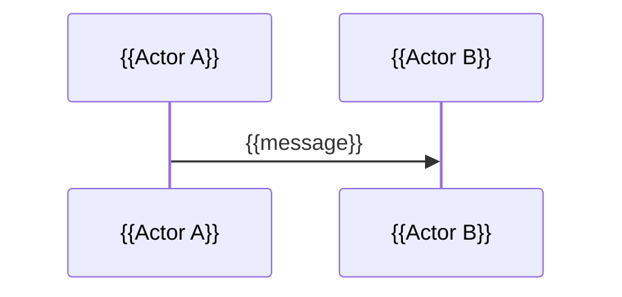

# Feature Specification: {{FEATURE_NAME}}

> Markdown is the source of truth. HTML is only a presentation layer for review and team handoff.

---

## 1. Document metadata

| Field | Value |
|---|---|
| Document ID | {{DOC_ID}} |
| Feature name | {{FEATURE_NAME}} |
| Feature type | {{new_feature / feature_upgrade}} |
| Version | {{VERSION}} |
| Status | {{Draft / In Review / Approved / Deprecated}} |
| BA / Owner | {{OWNER}} |
| PO / Stakeholder | {{STAKEHOLDER}} |
| Created date | {{YYYY-MM-DD}} |
| Last updated | {{YYYY-MM-DD}} |
| Target release | {{TARGET_RELEASE_OR_UNKNOWN}} |
| Source of truth | `feature-spec.md` |
| Output package | `{{PACKAGE_PATH}}` |
| Epic | {{EPIC_NAME_OR_ASSUMPTION}} |
| Story | {{STORY_NAME_OR_ASSUMPTION}} |

---

## 2. Input summary

### 2.1 Input classification

| Input type | Yes/No | Notes |
|---|---:|---|
| Business text | {{Yes/No}} | {{summary}} |
| Figma screenshot | {{Yes/No}} | {{summary}} |
| Figma link | {{Yes/No}} | {{summary}} |
| Related files | {{Yes/No}} | {{summary}} |
| Existing spec | {{Yes/No}} | {{summary}} |
| Change request | {{Yes/No}} | {{summary}} |
| Unclear input | {{Yes/No}} | {{summary}} |

### 2.2 Reference sources

| Source ID | Source type | Name / Link / Description | Used for extraction |
|---|---|---|---|
| SRC-001 | {{business_text/file/figma/screenshot}} | {{source_name_or_clickable_link}} | {{what_was_extracted}} |

### 2.3 Evidence log

| Evidence ID | Source | Processing status | Extracted evidence | Impact on spec |
|---|---|---|---|---|
| EVD-001 | {{User text / File / Figma}} | {{Processed / Unavailable / Failed / Skipped by request}} | {{summary}} | {{impact}} |

### 2.4 Figma evidence log

> Required when the input includes a Figma URL or Figma screenshot. Do not write `[FIGMA]` unless evidence has been extracted from MCP, a screenshot, or an exported frame.

| Figma ID | Label | Business step | Original Figma link | Node ID | MCP result | Extracted UI evidence | Notes / fallback |
|---|---|---|---|---|---|---|---|
| FIG-001 | {{label}} | {{business_step}} | [{{label}}]({{original_figma_url}}) | {{node_id}} | {{MCP_SUCCESS / MCP_UNAVAILABLE / MCP_FAILED / USER_SKIPPED / SCREENSHOT_ONLY}} | {{visible_ui_evidence_or_empty}} | {{notes}} |

### 2.5 Original Figma link list

> Required when a Figma URL exists. Dev/QA must be able to open the original design from this table. Do not record only the node ID and omit the link.

| ID | Label | Business step | Figma link | Notes |
|---|---|---|---|---|
| FIG-LINK-001 | {{label}} | {{business_step}} | [{{label}}]({{original_figma_url}}) | {{notes}} |

---

## 3. Source and confidence conventions

| Tag | Meaning |
|---|---|
| `[PROVIDED]` | Directly provided by the user |
| `[FIGMA]` | Extracted from a Figma screenshot/link/MCP |
| `[FILE]` | Extracted from a related file |
| `[INFERRED]` | Reasonably inferred from available information |
| `[ASSUMPTION]` | Assumption used to make the draft usable, needs confirmation |
| `[OPEN_QUESTION]` | Open question that may affect scope, logic, or testability |

---

## 4. Feature overview

### 4.1 Summary

{{A short description of the feature in English.}}

### 4.2 Problem / business opportunity

{{What problem the feature solves or what value it creates.}}

### 4.3 Desired outcome

{{The expected business outcome after the feature is implemented.}}

---

## 5. Business goals

| ID | Goal | Priority | Source |
|---|---|---|---|
| BG-001 | {{goal}} | {{Must/Should/Could}} | {{source_tag}} |

---

## 6. Scope

### 6.1 In scope

| ID | Item | Source |
|---|---|---|
| S-IN-001 | {{in_scope_item}} | {{source_tag}} |

### 6.2 Out of scope

| ID | Item | Reason / Notes |
|---|---|---|
| S-OUT-001 | {{out_of_scope_item}} | {{reason_or_source}} |

### 6.3 Future considerations

| ID | Item | Reason |
|---|---|---|
| FUT-001 | {{future_item}} | {{reason}} |

---

## 7. Stakeholders and roles

### 7.1 Stakeholders

| ID | Stakeholder | Decision role | Notes |
|---|---|---|---|
| STK-001 | {{stakeholder}} | {{decision/input/approval}} | {{notes}} |

### 7.2 User roles / actors

| ID | Role / Actor | Description | Permission summary | Source |
|---|---|---|---|---|
| ROLE-001 | {{role_name}} | {{description}} | {{summary}} | {{source_tag}} |

---

## 8. User stories

| ID | User story | Priority | Source |
|---|---|---|---|
| US-001 | As {{role}}, I want {{action}}, so that {{benefit}}. | {{Must/Should/Could}} | {{source_tag}} |

---

## 9. Business flow

### 9.1 Main flow

| Step ID | Actor | Trigger / Action | System response | Resulting state | Source |
|---|---|---|---|---|---|
| FLOW-001 | {{actor}} | {{action}} | {{response}} | {{state}} | {{source_tag}} |

### 9.2 Alternative flows

| Flow ID | Condition | Steps | Outcome | Source |
|---|---|---|---|---|
| ALT-001 | {{condition}} | {{steps}} | {{outcome}} | {{source_tag}} |

### 9.3 Flow diagram

```mermaid
flowchart TD
  A[Start] --> B[{{Step}}]
  B --> C{Condition?}
  C -->|Yes| D[{{Outcome}}]
  C -->|No| E[{{Alternative outcome}}]
```

---

## 10. Functional requirements

| ID | Requirement | Priority | Related role | Related flow | Source |
|---|---|---|---|---|---|
| FR-001 | The system must {{behavior}}. | {{Must/Should/Could}} | {{ROLE-001}} | {{FLOW-001}} | {{source_tag}} |

---

## 11. Business rules

Business rules are business decisions or constraints. Do not mix implementation details into them.

| ID | Rule | Applies to | Priority | Source |
|---|---|---|---|---|
| BR-001 | {{business_rule}} | {{role/flow/state/data}} | {{Must/Should/Could}} | {{source_tag}} |

---

## 12. Data requirements

### 12.1 Business data fields

| ID | Field | Business meaning | Required | Format / Allowed values | Source |
|---|---|---|---:|---|---|
| DR-001 | {{field_name}} | {{meaning}} | {{Yes/No/Conditional}} | {{format_or_values}} | {{source_tag}} |

### 12.2 Data creation/update rules

| ID | Data object | Event | Data change | Source |
|---|---|---|---|---|
| DR-101 | {{object}} | {{event}} | {{change}} | {{source_tag}} |

---

## 13. Validation rules

| ID | Field / Action | Validation rule | Error message / Behavior | Source |
|---|---|---|---|---|
| VR-001 | {{field_or_action}} | {{rule}} | {{message_or_behavior}} | {{source_tag}} |

---

## 14. Permission matrix

| Permission ID | Role | View | Create | Update | Delete | Approve | Reject | Export | Notes |
|---|---|---:|---:|---:|---:|---:|---:|---:|---|
| PERM-001 | {{role}} | {{Y/N}} | {{Y/N}} | {{Y/N}} | {{Y/N}} | {{Y/N}} | {{Y/N}} | {{Y/N}} | {{notes}} |

---

## 15. State transition

### 15.1 State list

| State ID | State | Description | Terminal? | Source |
|---|---|---|---:|---|
| STATE-001 | {{state}} | {{description}} | {{Yes/No}} | {{source_tag}} |

### 15.2 State transition rules

| ID | From state | Trigger / Action | Condition | To state | Actor | Source |
|---|---|---|---|---|---|---|
| TR-001 | {{from}} | {{trigger}} | {{condition}} | {{to}} | {{actor}} | {{source_tag}} |

### 15.3 State diagram

```mermaid
stateDiagram-v2
  [*] --> {{initial_state}}
  {{initial_state}} --> {{next_state}}: {{trigger}}
  {{next_state}} --> [*]
```

### 15.4 Additional diagrams if needed

Use Mermaid for other complex diagrams such as sequence diagrams, swimlane-style flowcharts, or role-based sub-flows. HTML must render these diagrams with the Mermaid.js CDN and still keep a source fallback.



---

## 16. Edge cases & error handling

### 16.1 Edge cases

| ID | Scenario | Expected behavior | Nguồn |
|---|---|---|---|
| EC-001 | {{scenario}} | {{expected_behavior}} | {{source_tag}} |

### 16.2 Error handling

| ID | Error / Failure | User-facing behavior | System behavior | Nguồn |
|---|---|---|---|---|
| ERR-001 | {{error}} | {{message_or_ui_behavior}} | {{system_behavior}} | {{source_tag}} |

---

## 17. Acceptance criteria

### 17.1 Checklist acceptance criteria

| ID | Acceptance criterion | Requirement liên quan | Ưu tiên |
|---|---|---|---|
| AC-001 | {{criterion}} | {{FR-001, BR-001}} | {{Must/Should/Could}} |

### 17.2 Gherkin scenarios

```gherkin
Feature: {{FEATURE_NAME}}

Scenario: {{scenario_name}}
  Given {{precondition}}
  When {{action_or_event}}
  Then {{expected_result}}
  And {{additional_expected_result}}
```

---

## 18. BA-level non-functional requirements

Only include NFRs that are supported by the input or needed at the business level.

| ID | Category | Requirement | Measurement / Expectation | Source |
|---|---|---|---|---|
| NFR-001 | {{Usability/Security/Auditability/Accessibility/Performance}} | {{requirement}} | {{measurement}} | {{source_tag}} |

---

## 19. Analytics / audit / logging

| ID | Event / Action | Actor | Data to capture | Purpose | Source |
|---|---|---|---|---|---|
| AUD-001 | {{event}} | {{actor}} | {{data}} | {{purpose}} | {{source_tag}} |

---

## 20. Dependencies

| ID | Dependency | Type | Impact | Owner | Source |
|---|---|---|---|---|---|
| DEP-001 | {{dependency}} | {{System/Team/API/Policy/Data/Figma}} | {{impact}} | {{owner_or_unknown}} | {{source_tag}} |

---

## 21. Feature upgrade details

> Use this section only for feature upgrades.

### 21.1 Current behavior

{{Describe existing behavior or mark [OPEN_QUESTION].}}

### 21.2 Requested change

{{Describe requested change.}}

### 21.3 Impact analysis

| ID | Impact area | Current state | After change | Impact / Risk |
|---|---|---|---|---|
| CHG-001 | {{area}} | {{current}} | {{new}} | {{impact}} |

### 21.4 Backward compatibility

{{State whether old behavior/data remains compatible.}}

### 21.5 Regression risks

| ID | Risk | Mitigation / Test focus |
|---|---|---|
| REG-001 | {{risk}} | {{mitigation}} |

---

## 22. Figma notes

> Use only when Figma input exists.

| ID | Screen / Frame | Observed UI elements | Business interpretation | Confidence |
|---|---|---|---|---|
| FIG-001 | {{screen}} | {{elements}} | {{interpretation}} | {{[FIGMA]/[INFERRED]/[OPEN_QUESTION]}} |

---

## 23. Assumptions

| ID | Assumption | Reason | Impact if wrong | Needs confirmation from |
|---|---|---|---|---|
| ASM-001 | {{assumption}} | {{reason}} | {{impact}} | {{person_or_role}} |

---

## 24. Open questions

| ID | Question | Group | Blocking? | Who should answer |
|---|---|---|---:|---|
| Q-001 | {{question}} | {{Business goal/User role/Flow/Data/Permission/etc.}} | {{Yes/No}} | {{role/team}} |

### 24.1 UI Open Questions

> Use only when screenshots are available. If a select list is not fully visible or a button purpose is unclear, ask instead of guessing.

| ID | Screen / element | What is visible | What needs clarification |
|---|---|---|---|
| UIQ-001 | {{screen / select hoặc button}} | {{giá trị/placeholder đang thấy}} | {{danh mục đầy đủ? / chức năng nút?}} |

---

## 25. Traceability matrix

| Source / Goal | Requirement | Business rule | Acceptance criteria | Test focus |
|---|---|---|---|---|
| {{BG-001/SRC-001}} | {{FR-001}} | {{BR-001}} | {{AC-001}} | {{test_focus}} |

---

## 26. Dev / QA handoff notes

### 26.1 Dev notes

- {{dev_note}}

### 26.2 QA notes

- {{qa_note}}

### 26.3 Not implemented in this scope

| ID | Item | Reason |
|---|---|---|
| NTI-001 | {{item}} | {{reason}} |

---

## 27. Quality checklist

| Check | Status | Notes |
|---|---:|---|
| Business goal rõ ràng | {{Pass/Fail/Partial}} | {{notes}} |
| Roles đã xác định | {{Pass/Fail/Partial}} | {{notes}} |
| Scope rõ ràng | {{Pass/Fail/Partial}} | {{notes}} |
| Main flow đã có | {{Pass/Fail/Partial}} | {{notes}} |
| Business rule tách khỏi implementation | {{Pass/Fail/Partial}} | {{notes}} |
| Data changes đã mô tả | {{Pass/Fail/Partial}} | {{notes}} |
| Permissions đã mô tả | {{Pass/Fail/Partial}} | {{notes}} |
| State transitions đã mô tả | {{Pass/Fail/Partial}} | {{notes}} |
| Edge cases/errors đã mô tả | {{Pass/Fail/Partial}} | {{notes}} |
| Acceptance criteria testable | {{Pass/Fail/Partial}} | {{notes}} |
| Assumptions đã đánh dấu | {{Pass/Fail/Partial}} | {{notes}} |
| Open questions đã liệt kê | {{Pass/Fail/Partial}} | {{notes}} |
| Traceability matrix đủ dùng | {{Pass/Fail/Partial}} | {{notes}} |
