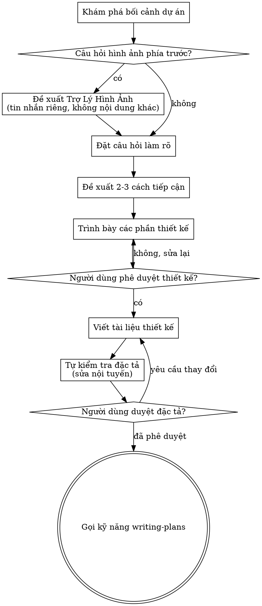

# Thảo Luận Ý Tưởng Thành Thiết Kế

Giúp biến ý tưởng thành thiết kế và đặc tả hoàn chỉnh thông qua đối thoại hợp tác tự nhiên.

Bắt đầu bằng cách hiểu bối cảnh dự án hiện tại, sau đó đặt câu hỏi từng câu một để tinh chỉnh ý tưởng. Khi bạn hiểu những gì cần xây dựng, trình bày thiết kế và nhận phê duyệt người dùng. Ưu tiên sử dụng cách hỏi tuần tự/hỏi-đáp theo lượt để làm rõ vấn đề cần hỏi.

<HARD-GATE>
KHÔNG được gọi bất kỳ kỹ năng triển khai nào, viết bất kỳ code nào, dựng bất kỳ dự án nào hoặc thực hiện bất kỳ hành động triển khai nào cho đến khi bạn đã trình bày thiết kế và người dùng đã phê duyệt. Điều này áp dụng cho MỌI dự án bất kể độ đơn giản nhận thức.
</HARD-GATE>

## Quét Cài Đặt

Trước giai đoạn câu hỏi Khám Phá, đọc `tais/setting.json` trong không gian làm việc hiện tại nếu có (dự phòng: `setting.json` tại gốc plugin) (chỉ đọc — không bao giờ thay đổi). Kiểm tra `policy.autoCommit`, `policy.autoTest`, `policy.dangerousCommands`, `policy.sensitiveFiles` và `policy.installAndUpdate` để định hình câu hỏi nào bạn đặt và giả định mặc định nào bạn chấp nhận.

BẮT BUỘC ghi nhớ các policy khi thực hiện, LUÔN ƯU TIÊN theo `tais/setting.json` trong không gian làm việc hiện tại nếu có hoặc `setting.json` tại gốc plugin để lấy policy.

## Phản Mẫu: "Đơn Giản Quá Không Cần Thiết Kế"

Mọi dự án đều trải qua quy trình này. Danh sách việc cần làm, tiện ích một hàm, thay đổi cấu hình — tất cả. Dự án "đơn giản" là nơi giả định chưa được kiểm tra gây lãng phí nhiều công việc nhất. Thiết kế có thể ngắn (vài câu cho dự án thực sự đơn giản), nhưng BẠN PHẢI trình bày và nhận phê duyệt.

## Danh Sách Kiểm Tra

BẠN PHẢI tạo nhiệm vụ cho mỗi mục này và hoàn thành theo thứ tự:

1. **Khám phá bối cảnh dự án** — kiểm tra file, tài liệu, commit gần đây
2. **Đề xuất trợ lý hình ảnh** (nếu chủ đề liên quan câu hỏi hình ảnh) — đây là tin nhắn riêng, không kết hợp với câu hỏi làm rõ. Xem phần Trợ Lý Hình Ảnh bên dưới.
3. **Đặt câu hỏi làm rõ** — từng câu một, hiểu mục đích/ràng buộc/tiêu chí thành công
4. **Đề xuất 2-3 cách tiếp cận** — với đánh đổi và khuyến nghị của bạn
5. **Trình bày thiết kế** — theo phần được chia tỷ lệ theo độ phức tạp, nhận phê duyệt người dùng sau mỗi phần
6. **Viết tài liệu thiết kế** — lưu vào `docs/tungnt-ai-skills/specs/YYYY-MM-DD-<topic>-design.md` và dựa vào `policy.autoCommit` để quyết định việc commit
7. **Tự kiểm tra đặc tả** — kiểm tra nội tuyến nhanh cho placeholder, mâu thuẫn, mơ hồ, phạm vi (xem bên dưới)
8. **Người dùng duyệt đặc tả đã viết** — yêu cầu người dùng duyệt file đặc tả trước khi tiếp tục
9. **Chuyển sang triển khai** — gọi kỹ năng writing-plans để tạo kế hoạch triển khai

## Quy Trình



**Trạng thái cuối cùng là gọi writing-plans.** KHÔNG gọi frontend-design, mcp-builder hoặc bất kỳ kỹ năng triển khai nào khác. KỸ NĂNG DUY NHẤT bạn gọi sau brainstorming là writing-plans.

## Quy Trình

**Hiểu ý tưởng:**

- Kiểm tra trạng thái dự án hiện tại trước (file, tài liệu, commit gần đây)
- Trước khi đặt câu hỏi chi tiết, đánh giá phạm vi: nếu yêu cầu mô tả nhiều hệ thống con độc lập (ví dụ "xây dựng nền tảng với chat, lưu trữ file, thanh toán và phân tích"), gắn cờ ngay lập tức. Đừng dành câu hỏi để tinh chỉnh chi tiết dự án cần được phân tách trước.
- Nếu dự án quá lớn cho một đặc tả duy nhất, giúp người dùng phân tách thành dự án con: những phần độc lập nào, chúng liên hệ thế nào, thứ tự xây dựng nên ra sao? Sau đó thảo luận dự án con đầu tiên thông qua quy trình thiết kế bình thường. Mỗi dự án con có chu kỳ đặc tả → kế hoạch → triển khai riêng.
- Với các dự án có phạm vi phù hợp, đặt câu hỏi từng câu một để tinh chỉnh ý tưởng (ưu tiên dạng câu hỏi tuần tự/hỏi-đáp theo lượt với người dùng để làm rõ)
- Ưa tiên câu hỏi trắc nghiệm khi có thể, nhưng câu hỏi mở cũng được
- Chỉ một câu mỗi tin nhắn — nếu chủ đề cần khám phá thêm, chia thành nhiều câu hỏi
- Tập trung vào hiểu: mục đích, ràng buộc, tiêu chí thành công

**Khám phá cách tiếp cận:**

- Đề xuất 2-3 cách tiếp cận khác nhau với đánh đổi
- Trình bày lựa chọn theo cách đối thoại với khuyến nghị và lý do
- Bắt đầu bằng tùy chọn được khuyến nghị và giải thích tại sao

**Trình bày thiết kế:**

- Khi bạn tin rằng mình hiểu những gì cần xây dựng, trình bày thiết kế

````marrkdown
**Thiết kế một API mới hoặc sửa API:**

- Dùng `skills/api-design` như công cụ kiểm tra để xác nhận thiết kế API mới có chính xác hay không.
- Chờ `skills/api-design` phản hồi rồi thực hiện các bước tiếp theo theo đúng hướng dẫn từ kỹ năng này.
- Nếu phát hiện lỗi hoặc lỗ hổng, hãy phân tích nguyên nhân, khắc phục rồi gọi lại `skills/api-design` để kiểm tra. Lặp lại tối đa 3 lần.
- Nếu sau 3 lần vẫn chưa khắc phục được, bắt buộc dừng `brainstorming` và thông báo: "Đang gặp vấn đề thiết kế UI/UX: kèm danh sách vấn đề đang gặp để người dùng quyết định bước tiếp theo."

- TUYỆT ĐỐI không được tiếp tục nếu đã thử đủ 3 lần mà vẫn chưa xử lý xong. Phải dừng thông để thông báo và chờ người dùng xác nhận.

**Đọc thiết kế figma từ ảnh chụp:**

- Dùng `skills/figma-to-code` như công cụ lấy ĐÚNG THEO thiết kế theo ảnh chụp figma hoặc đường dẫn figma từ style, front chữ và chỉ lấy các nội dung hiển thị không lấy nội dung ẩn.
- Chờ `skills/figma-to-code` phản hồi rồi thực hiện các bước tiếp theo theo đúng hướng dẫn từ kỹ năng này.
- Nếu phát hiện thiếu thông tin hoặc nội dung figma có vấn đề, hãy phân tích nguyên nhân, khắc phục rồi gọi lại `skills/figma-to-code` để kiểm tra. Lặp lại tối đa 3 lần.
- Nếu sau 3 lần vẫn chưa khắc phục được, bắt buộc dừng `brainstorming` và thông báo: "Đang gặp vấn đề cắt giao diện figma: kèm danh sách vấn đề đang gặp để người dùng quyết định bước tiếp theo."

**Thiết kế UI/UX:**

- Dùng `skills/ux-ui-pro-max` như công cụ kiểm tra để xác nhận thiết kế UI/UX có tự nhiên và thân thiện hay không.
- Chờ `skills/ux-ui-pro-max` phản hồi rồi thực hiện các bước tiếp theo theo đúng hướng dẫn từ kỹ năng này.
- Nếu phát hiện trải nghiệm tệ, giao diện lỗi hoặc lỗ hổng trải nghiệm, giao diện, hãy phân tích nguyên nhân, khắc phục rồi gọi lại `skills/ux-ui-pro-max` để kiểm tra. Lặp lại tối đa 3 lần.
- Nếu sau 3 lần vẫn chưa khắc phục được, bắt buộc dừng `brainstorming` và thông báo: "Đang gặp vấn đề thiết kế UI/UX: kèm danh sách vấn đề đang gặp để người dùng quyết định bước tiếp theo."

- TUYỆT ĐỐI không được tiếp tục nếu đã thử đủ 3 lần mà vẫn chưa xử lý xong. Phải dừng thông để thông báo và chờ người dùng xác nhận.
````

- Chia tỷ lệ mỗi phần theo độ phức tạp: vài câu nếu đơn giản, lên đến 200-300 từ nếu có nhiều sắc thái
- Hỏi sau mỗi phần liệu mọi thứ có ổn không
- Bao gồm: kiến trúc, thành phần, luồng dữ liệu, xử lý lỗi, kiểm thử
- Sẵn sàng quay lại và làm rõ nếu điều gì đó không hợp lý

**Thiết kế cho sự cô lập và rõ ràng:**

- Chia hệ thống thành các đơn vị nhỏ hơn, mỗi đơn vị có một mục đích rõ ràng, giao tiếp qua giao diện được xác định rõ, và có thể hiểu và kiểm thử độc lập
- Với mỗi đơn vị, bạn có thể trả lời: nó làm gì, cách sử dụng, và nó phụ thuộc vào ai?
- Người khác có thể hiểu đơn vị làm gì mà không đọc bên trong không? Bạn có thể thay đổi bên trong mà không phá vỡ người tiêu dùng không? Nếu không, ranh giới cần chỉnh.
- Các đơn vị nhỏ hơn, có ranh giới rõ ràng cũng dễ làm việc hơn — bạn lý luận tốt hơn về code có thể giữ trong ngữ cảnh cùng lúc, và bản sửa của bạn đáng tin cậy hơn khi file tập trung. Khi file lớn lên, đó thường là tín hiệu nó đang làm quá nhiều.

**Làm việc trong codebase hiện có:**

- Khám phá cấu trúc hiện tại trước khi đề xuất thay đổi. Tuân theo mẫu hiện có.
- Nơi code hiện có vấn đề ảnh hưởng đến công việc (ví dụ file quá lớn, ranh giới không rõ, trách nhiệm lẫn lộn), bao gồm cải thiện có mục tiêu như một phần của thiết kế — cách nhà phát triển giỏi cải thiện code họ đang làm.
- Không đề xuất refactor không liên quan. Giữ tập trung vào điều gì phụ vụ mục tiêu hiện tại.

## Nhân Tử Đặc Tả

Cuối thiết kế đã phê duyệt, tùy chọn bao gồm một Nhân Tử Đặc Tả ngắn gọn có thể sao chép trực tiếp vào `writing-plans`.

```markdown
## Nhân Tử Đặc Tả

**Mục tiêu:** <một câu mô tả kết quả>

**Người dùng:** <ai được hưởng lợi hoặc vận hành thay đổi>

**Tiêu Chí Chấp Thuận:**
- Khi <điều kiện tiên quyết>, khi <hành động>, thì <kết quả mong đợi>.

**Ràng Buộc:**
- <ràng buộc kỹ thuật, quy trình, tương thích hoặc phụ thuộc không thể thương lượng>

**Ngoài Phạm Vi:**
- <mục tiêu không rõ ràng>
```

Sử dụng Nhân Tử Đặc Tả khi nó cải thiện độ rõ ràng chuyển giao. Không thay thế tài liệu thiết kế đầy đủ khi công việc phức tạp.

## Sau Thiết Kế

**Đánh giá bảo mật thiết kế:**

- Dùng `skills/security-and-hardening` như công cụ kiểm tra để an toàn bảo mật trong thiết kế.
- Chờ `skills/security-and-hardening` phản hồi rồi thực hiện các bước tiếp theo theo đúng hướng dẫn từ kỹ năng này.
- Nếu phát hiện lỗi bảo mật, hãy phân tích nguyên nhân, khắc phục rồi gọi lại `skills/security-and-hardening` để kiểm tra. Lặp lại tối đa 3 lần.
- Nếu sau 3 lần vẫn chưa khắc phục được, bắt buộc dừng `brainstorming` và thông báo: "Đang gặp vấn đề bảo mật: kèm danh sách vấn đề đang gặp để người dùng quyết định bước tiếp theo."

- TUYỆT ĐỐI không được tiếp tục nếu đã thử đủ 3 lần mà vẫn chưa xử lý xong. Phải dừng thông để thông báo và chờ người dùng xác nhận.

**Tài liệu:**

- Ghi thiết kế đã xác nhận (đặc tả) vào `docs/tungnt-ai-skills/specs/YYYY-MM-DD-<topic>-design.md`
  - (Sở thích người dùng về vị trí đặc tả ghi đè mặc định này)
- Sử dụng kỹ năng elements-of-style:writing-clearly-and-concisely nếu có
- Tuân thủ theo `policy.autoCommit` để xác định commit tài liệu thiết kế vào git nếu được approved

**Tự Kiểm Tra Đặc Tả:**
Sau khi viết tài liệu đặc tả, nhìn lại bằng con mắt mới:

1. **Quét placeholder:** Có "TBD", "TODO", phần chưa hoàn thành hoặc yêu cầu mơ hồ nào không? Sửa chúng.
2. **Tính nhất quán nội bộ:** Có phần nào mâu thuẫn với nhau không? Kiến trúc có khớp với mô tả tính năng không?
3. **Kiểm tra phạm vi:** Có đủ tập trung cho một kế hoạch triển khai duy nhất không, hay cần phân tách?
4. **Kiểm tra mơ hồ:** Yêu cầu nào có thể được hiểu theo hai cách khác nhau không? Nếu có, chọn một cách và làm rõ ràng.

Sửa bất kỳ vấn đề nào nội tuyến. Không cần kiểm tra lại — chỉ sửa và tiếp tục.

**Cổng Duyệt Người Dùng:**
Sau khi vòng tự kiểm tra đặc tả vượt qua, yêu cầu người dùng duyệt đặc tả đã viết trước khi tiếp tục:

Dựa vào `policy.autoCommit` dự án xác định câu trả lời:

- Với ``policy.autoCommit = true`

> "Đặc tả đã được viết và commit vào `<path>`. Vui lòng duyệt và cho tôi biết nếu bạn muốn thay đổi bất kỳ điều gì trước khi chúng ta bắt đầu viết kế hoạch triển khai."

- Với `policy.autoCommit = false`

> "Đặc tả đã được viết vào `<path>`. Vui lòng duyệt và cho tôi biết nếu bạn muốn thay đổi bất kỳ điều gì trước khi chúng ta bắt đầu viết kế hoạch triển khai."

Chờ phản hồi người dùng. Nếu họ yêu cầu thay đổi, thực hiện và chạy lại vòng kiểm tra đặc tả. Chỉ tiếp tục khi người dùng phê duyệt.

**Triển khai:**

- Gọi kỹ năng writing-plans để tạo kế hoạch triển khai chi tiết
- KHÔNG gọi bất kỳ kỹ năng nào khác. writing-plans là bước tiếp theo.

## Nguyên Tắc Cốt Lõi

- **Một câu hỏi mỗi lần** — Đừng choáng ngợp với nhiều câu hỏi
- **Ưa trắc nghiệm** — Dễ trả lời hơn câu hỏi mở khi có thể
- **YAGNI triệt để** — Loại bỏ tính năng không cần thiết khỏi mọi thiết kế
- **Khám phá thay thế** — Luôn đề xuất 2-3 cách tiếp cận trước khi quyết định
- **Xác nhận dần** — Trình bày thiết kế, nhận phê duyệt trước khi tiếp tục
- **Linh hoạt** — Quay lại và làm rõ khi điều gì đó không hợp lý

## Trợ Lý Hình Ảnh

Trợ lý dựa trên trình duyệt để hiển thị mockup, sơ đồ và tùy chọn hình ảnh trong quá trình thảo luận. Có sẵn dưới dạng công cụ — không phải chế độ. Chấp nhận trợ lý có nghĩa là nó sẵn sàng cho các câu hỏi được hưởng lợi từ xử lý hình ảnh; điều đó KHÔNG có nghĩa mọi câu hỏi đều qua trình duyệt.

**Đề xuất trợ lý:** Khi bạn dự đoán các câu hỏi sắp tới sẽ liên quan nội dung hình ảnh (mockup, bố cục, sơ đồ), đề xuất một lần để xin đồng ý:
> "Một số nội dung chúng ta đang làm có thể dễ giải thích hơn nếu tôi có thể hiển thị cho bạn trên trình duyệt web. Tôi có thể tạo mockup, sơ đồ, so sánh và hình ảnh khác trong khi chúng ta làm. Tính năng này vẫn mới và có thể tiêu tốn token. Bạn muốn thử không? (Cần mở URL cục bộ)"

**Đề xuất này PHẢI là tin nhắn riêng.** Không kết hợp với câu hỏi làm rõ, tóm tắt bối cảnh hoặc bất kỳ nội dung nào khác. Tin nhắn chỉ nên chứa ĐỀ XUẤT ở trên và không gì khác. Chờ phản hồi người dùng trước khi tiếp tục. Nếu họ từ chối, tiếp tục thảo luận chỉ bằng văn bản.

**Quyết định cho mỗi câu hỏi:** Ngay cả sau khi người dùng chấp nhận, quyết định CHO MỖI CÂU HỎI có sử dụng trình duyệt hay terminal. Bài kiểm tra: **người dùng sẽ hiểu điều này tốt hơn khi thấy nó hơn là đọc nó?**

- **Sử dụng trình duyệt** cho nội dung HÌNH ẢNH — mockup, wireframe, so sánh bố cục, sơ đồ kiến trúc, thiết kế hình ảnh cạnh nhau
- **Sử dụng terminal** cho nội dung văn bản — câu hỏi yêu cầu, lựa chọn khái niệm, danh sách đánh đổi, tùy chọn văn bản A/B/C/D, quyết định phạm vi

Câu hỏi về chủ đề UI không tự động là câu hỏi hình ảnh. "Ý nghĩa của cá tính trong ngữ cảnh này là gì?" là câu hỏi khái niệm — sử dụng terminal. "Bố cục wizard nào hoạt động tốt hơn?" là câu hỏi hình ảnh — sử dụng trình duyệt.

Nếu họ đồng ý với trợ lý, đọc hướng dẫn chi tiết trước khi tiếp tục:
`skills/brainstorming/visual-companion.md`
