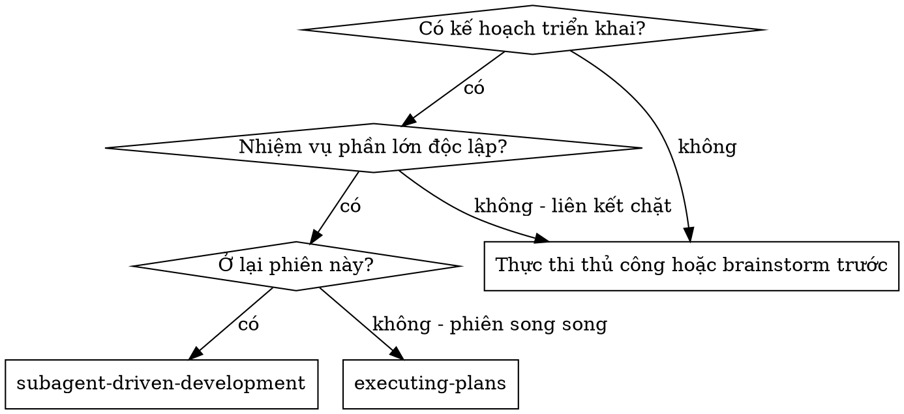
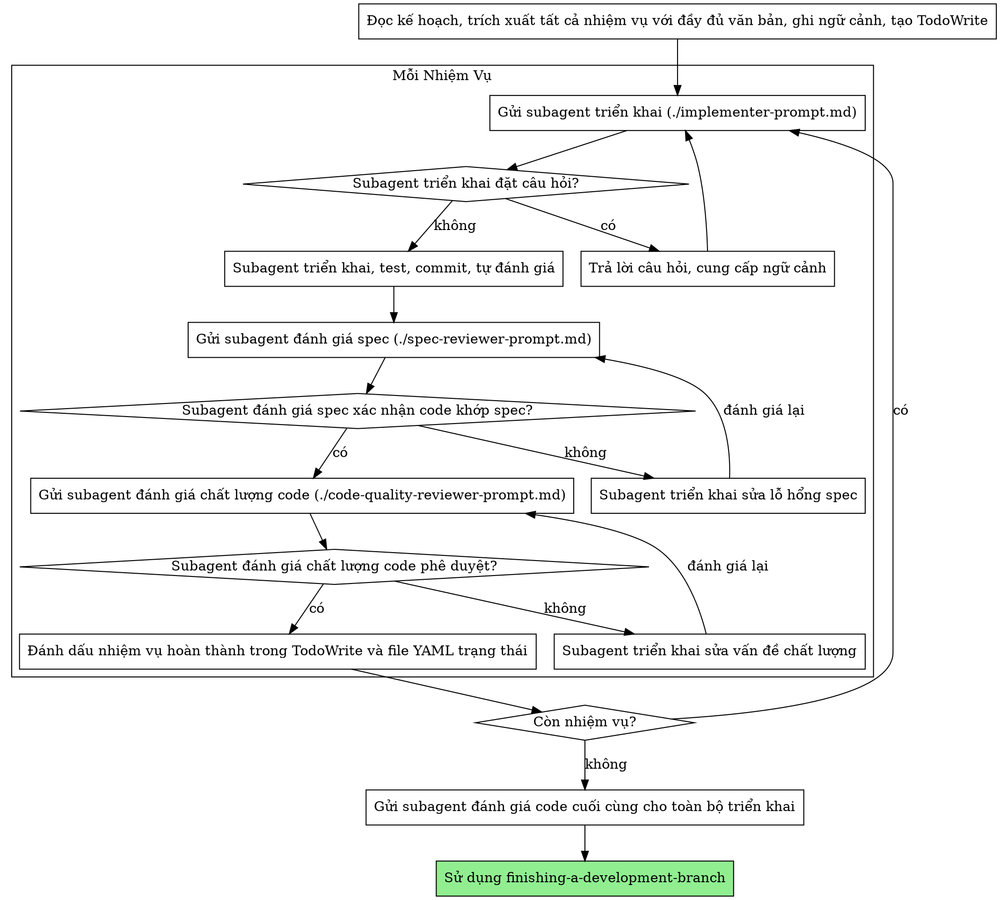

# Phát Triển Điều Khiển Bởi Subagent

Thực thi kế hoạch bằng cách gửi subagent mới cho mỗi nhiệm vụ, với đánh giá hai giai đoạn sau mỗi lần: đánh giá tuân thủ spec trước, sau đó đánh giá chất lượng code.

**Tại sao subagent:** Bạn ủy thác nhiệm vụ cho các agent chuyên biệt với ngữ cảnh cô lập. Bằng cách chế tác chính xác hướng dẫn và ngữ cảnh của chúng, bạn đảm bảo chúng tập trung và thành công trong nhiệm vụ. Chúng không bao giờ kế thừa ngữ cảnh hoặc lịch sử phiên của bạn — bạn xây dựng chính xác những gì chúng cần. Điều này cũng bảo toàn ngữ cảnh của bạn cho công việc phối hợp.

**Nguyên tắc cốt lõi:** Subagent mới cho mỗi nhiệm vụ + đánh giá hai giai đoạn (spec rồi chất lượng) = chất lượng cao, lặp lại nhanh

**Thực thi liên tục:** Không dừng để hỏi ý kiến đối tác giữa các nhiệm vụ. Thực thi tất cả nhiệm vụ từ kế hoạch mà không dừng. Lý do duy nhất để dừng là: trạng thái BLOCKED bạn không giải quyết được, sự mơ hồ thực sự ngăn tiến độ hoặc tất cả nhiệm vụ hoàn thành. Câu hỏi "Tôi có nên tiếp tục?" và tóm tắt tiến độ lãng phí thời gian họ — họ đã yêu cầu bạn thực thi kế hoạch, nên thực thi.

## Tuân Thủ Cài Đặt

Trước khi gửi người triển khai đầu tiên, kiểm tra policy đã lưu trước đó (nếu có) không tìm thấy hoặc chưa ghi nhớ BẮT BUỘC đọc `tais/setting.json` trong không gian làm việc hiện tại nếu có (dự phòng: `setting.json` tại gốc plugin). Subagent bỏ qua bootstrap, nên bộ điều khiển phải truyền chính sách liên quan trong mỗi prompt triển khai:

- **`policy.autoCommit`**: Khi `false`, nói người triển khai bỏ qua commit — để lại thay đổi chưa commit.
- **`policy.autoTest`**: Khi `false`, nói người triển khai bỏ qua chạy test trừ khi được yêu cầu rõ ràng.
- **`policy.dangerousCommands.blocked`**: Truyền danh sách lệnh bị chặn để người triển khai tránh chúng.
- **`policy.sensitiveFiles.blocked`**: Truyền mẫu file bị chặn để người triển khai tránh chúng.

BẮT BUỘC ghi nhớ các policy khi thực hiện, LUÔN ƯU TIÊN theo `tais/setting.json` trong không gian làm việc hiện tại nếu có hoặc `setting.json` tại gốc plugin để lấy policy.

## Theo Dõi Trạng Thái

Sử dụng theo dõi trạng thái cho kế hoạch nhiều nhiệm vụ bằng cách thay đổi trạng thái `docs/tungnt-ai-skills/plans/YYYY-MM-DD-<feature-name>.md` hoặc `docs/tungnt-ai-skills/plans/YYYY-MM-DD-<feature-name>/*.md` cùng TodoWrite.

- Đánh dấu mỗi nhiệm vụ `in-progress` ngay trước khi gửi subagent triển khai trong file markdown.
- Đánh dấu mỗi nhiệm vụ `complete` với `completed_at: YYYY-MM-DD` chỉ sau khi tuân thủ spec và đánh giá chất lượng code đều vượt qua ngay trong file markdown.
- Đặt `overall_status: complete` sau khi người đánh giá code cuối cùng vượt qua.
- Nếu file bị thiếu trong phiên tiếp tục, tái tạo từ kế hoạch và đánh dấu các nhiệm vụ đã hoàn thành dựa trên commit, checkbox kế hoạch đã chọn và bản ghi đánh giá.

## Hỗ Trợ Kế Hoạch Pha

Khi kế hoạch sử dụng đầu ra theo pha (`docs/tungnt-ai-skills/plans/YYYY-MM-DD-<feature-name>/plan.md` + file `docs/tungnt-ai-skills/plans/YYYY-MM-DD-<feature-name>/phase-*.md`), thực thi các pha tuần tự theo thứ tự phụ thuộc:

1. Đọc `plan.md` để trích xuất bảng ánh xạ pha và đồ thị phụ thuộc.
2. Với mỗi pha (tôn trọng phụ thuộc):
   a. Đọc file `phase-*.md` và kiểm tra `status` trong frontmatter.
   b. Bỏ qua pha đã đánh dấu `complete`.
   c. Trích xuất các bước triển khai thành nhiệm vụ và thực thi dùng luồng mỗi-nhiệm-vụ thông thường.
   d. Cập nhật frontmatter pha `status` thành `complete` khi tất cả nhiệm vụ và đánh giá vượt qua.
3. Sau khi tất cả pha hoàn thành, tiến đến đánh giá code cuối cùng và hoàn tất.

Frontmatter pha là nguồn chính thức cho tiến độ pha. File `plan` hoặc `phase-*` có trạng thái tùy chọn vẫn chỉ là theo dõi runtime. File kế hoạch đơn sử dụng luồng hiện tại không thay đổi.

## Khi Nào Sử Dụng



**vs. Thực Thi Kế Hoạch (phiên song song):**
- Cùng phiên (không chuyển ngữ cảnh)
- Subagent mới cho mỗi nhiệm vụ (không ô nhiễm ngữ cảnh)
- Đánh giá hai giai đoạn sau mỗi nhiệm vụ: tuân thủ spec trước, sau đó chất lượng code
- Lặp lại nhanh hơn (không người-norman-giữa-các-nhiệm-vụ)

## Quy Trình



Cũng cập nhật file YAML trạng thái cho nhiệm vụ đó trước khi chuyển nhiệm vụ tiếp theo.

## Chọn Mô Hình

Sử dụng mô hình mạnh nhất có thể xử lý mỗi vai trò để tiết kiệm chi phí và tăng tốc độ.

**Nhiệm vụ triển khai cơ học** (hàm cô lập, spec rõ, 1-2 file): sử dụng mô hình nhanh, rẻ. Hầu hết nhiệm vụ triển khai là cơ học khi kế hoạch được đặc tả tốt.

**Nhiệm vụ tích hợp và phán xét** (phối hợp đa file, đối chiếu mẫu, gỡ lỗi): sử dụng mô hình tiêu chuẩn.

**Nhiệm vụ kiến trúc, thiết kế và đánh giá**: sử dụng mô hình có khả năng nhất.

**Tín hiệu độ phức tạp nhiệm vụ:**
- Chạm 1-2 file với spec đầy đủ → mô hình rẻ
- Chạm nhiều file với lo ngại tích hợp → mô hình tiêu chuẩn
- Cần phán xét thiết kế hoặc hiểu codebase rộng → mô hình có khả năng nhất

## Xử Lý Trạng Thái Người Triển Khai

Subagent triển khai báo cáo một trong bốn trạng thái. Xử lý mỗi cái appropriately:

**DONE:** Tiến đến đánh giá tuân thủ spec.

**DONE_WITH_CONCERNS:** Người triển khai hoàn thành công việc nhưng gắn cờ nghi ngờ. Đọc mối quan ngại trước khi tiến hành. Nếu quan ngại về đúng đắn hoặc phạm vi, giải quyết trước khi đánh giá. Nếu chỉ là quan sát (ví dụ "file này đang lớn"), ghi chú và tiến hành đánh giá.

**NEEDS_CONTEXT:** Người triển khai cần thông tin không được cung cấp. Cung cấp ngữ cảnh thiếu và gửi lại.

**BLOCKED:** Người triển khai không thể hoàn thành nhiệm vụ. Đánh giá chặn:
1. Nếu đó là vấn đề ngữ cảnh, cung cấp thêm ngữ cảnh và gửi lại cùng mô hình
2. Nếu nhiệm vụ cần nhiều lý luận hơn, gửi lại với mô hình có khả năng hơn
3. Nếu nhiệm vụ quá lớn, chia thành mảnh nhỏ hơn
4. Nếu kế hoạch itself sai, leo thang cho người

**Không bao giờ** bỏ qua leo thang hoặc ép buộc mô hình tương tự thử lại mà không thay đổi. Nếu người triển khai nói bị kẹt, cần thay đổi.

## Mẫu Prompt

- `./implementer-prompt.md` - Gửi subagent triển khai
- `./spec-reviewer-prompt.md` - Gửi subagent đánh giá tuân thủ spec
- `./code-quality-reviewer-prompt.md` - Gửi subagent đánh giá chất lượng code

## Ví Dụ Quy Trình

```
Bạn: Tôi đang sử dụng Phát Triển Điều Khiển Bởi Subagent để thực thi kế hoạch này.

[Đọc file kế hoạch một lần: docs/tungnt-ai-skills/plans/feature-plan.md]
[Trích xuất tất cả 5 nhiệm vụ với đầy đủ văn bản và ngữ cảnh]
[Tạo TodoWrite với tất cả nhiệm vụ]

Nhiệm vụ 1: Script cài đặt hook

[Lấy văn bản và ngữ cảnh Nhiệm vụ 1 (đã trích xuất)]
[Gửi subagent triển khai với đầy đủ văn bản nhiệm vụ + ngữ cảnh]

Người triển khai: "Trước khi bắt đầu - hook nên cài đặt ở cấp người dùng hay hệ thống?"

Bạn: "Cấp người dùng (~/.config/tungnt-ai-skills/hooks/)"

Người triển khai: "Hiểu. Đang triển khai..."
[Sau đó] Người triển khai:
  - Đã triển khai lệnh cài đặt hook
  - Thêm test, 5/5 pass
  - Tự đánh giá: Phát hiện thiếu cờ --force, đã thêm
  - Đã commit

[Gửi người đánh giá tuân thủ spec]
Người đánh giá spec: ✅ Tuân thủ spec - tất cả yêu cầu đáp ứng, không thêm gì

[Lấy git SHA, gửi người đánh giá chất lượng code]
Người đánh giá code: Điểm mạnh: Phủ nhận test tốt, sạch. Vấn đề: Không có. Phê duyệt.

[Đánh dấu Nhiệm vụ 1 hoàn thành]

Nhiệm vụ 2: Chế độ khôi phục

[Lấy văn bản và ngữ cảnh Nhiệm vụ 2 (đã trích xuất)]
[Gửi subagent triển khai với đầy đủ văn bản nhiệm vụ + ngữ cảnh]

Người triển khai: [Không câu hỏi, tiến hành]
Người triển khai:
  - Đã thêm chế độ verify/repair
  - 8/8 test pass
  - Tự đánh giá: Tất cả ổn
  - Đã commit

[Gửi người đánh giá tuân thủ spec]
Người đánh giá spec: ❌ Vấn đề:
  - Thiếu: Báo cáo tiến trình (spec nói "báo cáo mỗi 100 mục")
  - Thêm: Thêm cờ --json (không yêu cầu)

[Người triển khai sửa vấn đề]
Người triển khai: Đã xóa cờ --json, thêm báo cáo tiến trình

[Người đánh giá spec đánh giá lại]
Người đánh giá spec: ✅ Bây giờ tuân thủ spec

[Gửi người đánh giá chất lượng code]
Người đánh giá code: Điểm mạnh: Vững chắc. Vấn đề (Quan trọng): Con số ma thuật (100)

[Người triển khai sửa]
Người triển khai: Đã trích xuất hằng PROGRESS_INTERVAL

[Người đánh giá code đánh giá lại]
Người đánh giá code: ✅ Phê duyệt

[Đánh dấu Nhiệm vụ 2 hoàn thành]

...

[Sau tất cả nhiệm vụ]
[Gửi người đánh giá code cuối cùng]
Người đánh giá cuối: Tất cả yêu cầu đáp ứng, sẵn sàng merge

Xong!
```

## Ưu Điểm

**vs. Thực thi thủ công:**
- Subagent tuân theo TDD tự nhiên
- Ngữ cảnh mới cho mỗi nhiệm vụ (không nhầm lẫn)
- An toàn song song (subagent không can thiệp)
- Subagent có thể đặt câu hỏi (trước VÀ trong khi làm việc)

**vs. Thực Thi Kế Hoạch:**
- Cùng phiên (không chuyển giao)
- Tiến độ liên tục (không chờ)
- Điểm kiểm tra đánh giá tự động

**Hiệu quả:**
- Không chi phí đọc file (bộ điều khiển cung cấp đầy đủ văn bản)
- Bộ điều khiển chọn lọc chính xác ngữ cảnh cần thiết
- Subagent nhận thông tin đầy đủ ngay từ đầu
- Câu hỏi nổi lên trước khi công việc bắt đầu (không phải sau)

**Cổng chất lượng:**
- Tự đánh giá bắt vấn đề trước khi chuyển giao
- Đánh giá hai giai đoạn: tuân thủ spec, sau đó chất lượng code
- Vòng đánh giá đảm bảo sửa thực sự hoạt động
- Tuân thủ spec ngăn xây dựng quá/thiếu
- Chất lượng code đảm bảo triển khai được xây dựng tốt

**Chi phí:**
- Nhiều lần gọi subagent hơn (người triển khai + 2 người đánh giá cho mỗi nhiệm vụ)
- Bộ điều khiển làm nhiều công việc chuẩn bị hơn (trích xuất tất cả nhiệm vụ ngay từ đầu)
- Vòng đánh giá thêm lần lặp
- Nhưng bắt vấn đề sớm (rẻ hơn gỡ lỗi sau)

## Tín Hiệu Cảnh Báo

**Không bao giờ:**
- Bắt đầu triển khai trên nhánh main/master không có sự đồng ý rõ ràng của người dùng
- Bỏ qua đánh giá (tuân thủ spec HOẶC chất lượng code)
- Tiến hành với vấn đề chưa sửa
- Gửi nhiều subagent triển khai song song (xung đột)
- Để subagent đọc file kế hoạch (cung cấp đầy đủ văn bản thay thế)
- Bỏ qua ngữ cảnh thiết lập (subagent cần hiểu nhiệm vụ phù hợp ở đâu)
- Bỏ qua câu hỏi subagent (trả lời trước khi để chúng tiến hành)
- Chấp nhận "gần đúng" trên tuân thủ spec (người đánh giá spec tìm vấn đề = chưa xong)
- Bỏ qua vòng đánh giá (người đánh giá tìm vấn đề = người triển khai sửa = đánh giá lại)
- Để người triển khai tự đánh giá thay thế đánh giá thực (cả hai đều cần)
- **Bắt đầu đánh giá chất lượng code trước khi tuân thủ spec là ✅** (thứ tự sai)
- Chuyển nhiệm vụ tiếp theo khi bất kỳ đánh giá nào còn vấn đề mở

**Nếu subagent đặt câu hỏi:**
- Trả lời rõ ràng và đầy đủ
- Cung cấp ngữ cảnh bổ sung nếu cần
- Đừng gấp gáp chúng vào triển khai

**Nếu người đánh giá tìm vấn đề:**
- Người triển khai (cùng subagent) sửa chúng
- Người đánh giá đánh giá lại
- Lặp lại cho đến khi phê duyệt
- Đừng bỏ qua đánh giá lại

**Nếu subagent thất bại nhiệm vụ:**
- Gửi subagent sửa với hướng dẫn cụ thể
- Đừng cố sửa thủ công (ô nhiễm ngữ cảnh)

## Tích Hợp

**Kỹ năng quy trình bắt buộc:**
- **using-git-worktrees** - Đảm bảo không gian làm việc cô lập (tạo hoặc xác minh hiện có)
- **writing-plans** - Tạo kế hoạch mà kỹ năng này thực thi
- **requesting-code-review** - Mẫu code review cho subagent đánh giá
- **finishing-a-development-branch** - Hoàn thành phát triển sau tất cả nhiệm vụ

**Subagent nên sử dụng:**
- Các bước xác minh RED/GREEN đã viết của nhiệm vụ từ `writing-plans`. Nếu dự án cục bộ cung cấp kỹ năng TDD riêng, sử dụng nó như hướng dẫn hỗ trợ; nếu không, các bước test-fail-trước của kế hoạch là权威 TDD.

**Quy trình thay thế:**
- **executing-plans** - Sử dụng cho phiên song song thay vì thực thi cùng phiên