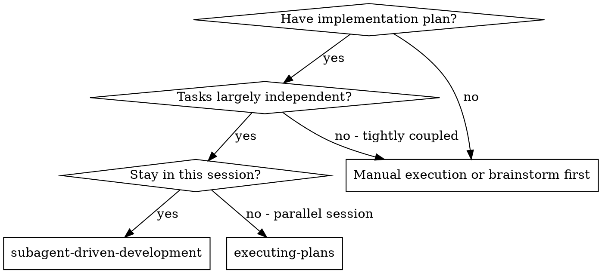
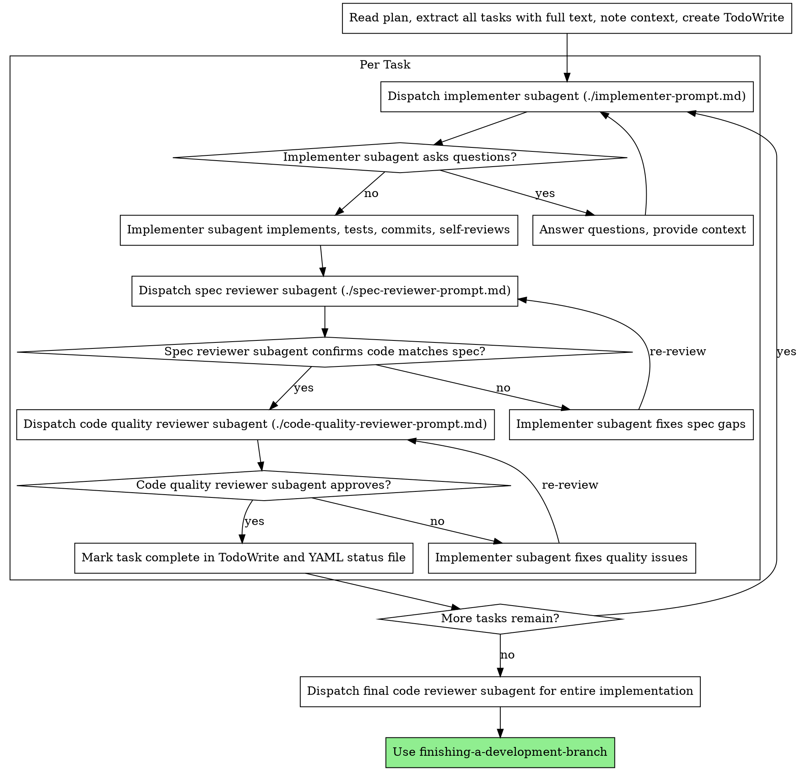

# Subagent-Driven Development

Execute a plan by dispatching a new subagent for each task, with a two-stage review after each: spec compliance review first, then code quality review.

**Why subagents:** You delegate tasks to specialized agents with isolated context. By carefully crafting their instructions and context, you ensure they stay focused and succeed at their task. They never inherit your context or session history — you build precisely what they need. This also preserves your context for coordination work.

**Core Principle:** New subagent per task + two-stage review (spec then quality) = high quality, fast iteration

**Continuous Execution:** Do not stop to ask for partner opinion between tasks. Execute all tasks from the plan without stopping. The only reasons to stop are: a BLOCKED status you cannot resolve, genuine ambiguity preventing progress, or all tasks complete. Asking "Should I continue?" and progress summaries waste their time — they asked you to execute the plan, so execute it.

## Settings Compliance

Before dispatching the first implementer, check previously saved policies (if any); if not found or not remembered, MUST read `tais/setting.json` in the current workspace if available (fallback: `setting.json` at plugin root). Subagents skip bootstrap, so the controller must pass relevant policies in every implementation prompt:

- **`policy.autoCommit`**: When `false`, tell implementer to skip commits — leave changes uncommitted.
- **`policy.autoTest`**: When `false`, tell implementer to skip running tests unless explicitly requested.
- **`policy.dangerousCommands.blocked`**: Pass blocked command list so implementer avoids them.
- **`policy.sensitiveFiles.blocked`**: Pass blocked file patterns so implementer avoids them.

MUST remember policies when executing, ALWAYS PRIORITIZE following `tais/setting.json` in the current workspace if available or `setting.json` at plugin root to get policies.

## Status Tracking

Use status tracking for multi-task plans by changing status in `docs/tungnt-ai-skills/plans/YYYY-MM-DD-<feature-name>.md` or `docs/tungnt-ai-skills/plans/YYYY-MM-DD-<feature-name>/*.md` along with TodoWrite.

- Mark each task `in-progress` right before dispatching implementation subagent in markdown file.
- Mark each task `complete` with `completed_at: YYYY-MM-DD` only after both spec compliance and code quality review pass directly in markdown file.
- Set `overall_status: complete` after final code reviewer passes.
- If file is missing in resumed session, recreate from plan and mark completed tasks based on commits, checked plan checkboxes, and review logs.

## Phased Plan Support

When the plan uses phased output (`docs/tungnt-ai-skills/plans/YYYY-MM-DD-<feature-name>/plan.md` + `docs/tungnt-ai-skills/plans/YYYY-MM-DD-<feature-name>/phase-*.md` files), execute phases sequentially in dependency order:

1. Read `plan.md` to extract phase mapping table and dependency graph.
2. For each phase (respecting dependencies):
   a. Read `phase-*.md` file and check `status` in frontmatter.
   b. Skip phases marked `complete`.
   c. Extract implementation steps into tasks and execute using normal per-task flow.
   d. Update phase frontmatter `status` to `complete` when all tasks and reviews pass.
3. After all phases complete, proceed to final code review and finish.

Phase frontmatter is the official source of truth for phase progress. Plan file or `phase-*` with optional status remains only runtime tracking. Single plan files use current unchanged flow.

## When to Use



**vs. Executing Plans (parallel session):**
- Same session (no context switching)
- New subagent per task (no context pollution)
- Two-stage review after each task: spec compliance first, then code quality
- Faster iteration (no human-in-the-loop between tasks)

## The Process



Also update the YAML status file for that task before moving to the next task.

## Model Selection

Use the strongest model capable of handling each role to save costs and increase speed.

**Mechanical implementation tasks** (isolated functions, clear specs, 1-2 files): use fast, cheap model. Most implementation tasks are mechanical when the plan is well-specified.

**Integration and judgment tasks** (multi-file coordination, pattern matching, debugging): use standard model.

**Architecture, design, and review tasks**: use most capable model.

**Task complexity signals:**
- Touch 1-2 files with full spec → cheap model
- Touch multiple files with integration concerns → standard model
- Need design judgment or broad codebase understanding → most capable model

## Handling Implementer Status

Implementer subagents report one of four statuses. Handle each appropriately:

**DONE:** Proceed to spec compliance review.

**DONE_WITH_CONCERNS:** Implementer completed work but flagged doubts. Read concerns before proceeding. If concerns are about correctness or scope, resolve before review. If just observations (e.g. "this file is getting large"), note and proceed to review.

**NEEDS_CONTEXT:** Implementer needs information not provided. Provide missing context and re-dispatch.

**BLOCKED:** Implementer cannot complete task. Evaluate block:
1. If context issue, provide more context and re-dispatch with same model
2. If task needs more reasoning, re-dispatch with more capable model
3. If task is too large, split into smaller pieces
4. If plan itself is wrong, escalate to human

**Never** ignore escalation or force similar model to retry without changes. If implementer says stuck, a change is needed.

## Prompt Templates

- `./implementer-prompt.md` - Dispatch implementer subagent
- `./spec-reviewer-prompt.md` - Dispatch spec compliance reviewer subagent
- `./code-quality-reviewer-prompt.md` - Dispatch code quality reviewer subagent

## Workflow Example

```
You: I am using Subagent-Driven Development to execute this plan.

[Read plan file once: docs/tungnt-ai-skills/plans/feature-plan.md]
[Extract all 5 tasks with full text and context]
[Create TodoWrite with all tasks]

Task 1: Hook installation script

[Get Task 1 text and context (already extracted)]
[Dispatch implementer subagent with full task text + context]

Implementer: "Before starting - should hook install at user or system level?"

You: "User level (~/.config/tungnt-ai-skills/hooks/)"

Implementer: "Understood. Implementing..."
[Later] Implementer:
  - Implemented hook install command
  - Added tests, 5/5 pass
  - Self-review: Detected missing --force flag, added
  - Committed

[Dispatch spec compliance reviewer]
Spec reviewer: ✅ Spec compliant - all requirements met, nothing extra

[Get git SHAs, dispatch code quality reviewer]
Code reviewer: Strengths: Good test coverage, clean. Issues: None. Approved.

[Mark Task 1 complete]

Task 2: Recovery modes

[Get Task 2 text and context (already extracted)]
[Dispatch implementer subagent with full task text + context]

Implementer: [No questions, proceeds]
Implementer:
  - Added verify/repair mode
  - 8/8 tests pass
  - Self-review: All good
  - Committed

[Dispatch spec compliance reviewer]
Spec reviewer: ❌ Issues:
  - Missing: Progress reporting (spec says "report every 100 items")
  - Extra: Added --json flag (not requested)

[Implementer fixes issues]
Implementer: Removed --json flag, added progress reporting

[Spec reviewer re-reviews]
Spec reviewer: ✅ Now spec compliant

[Dispatch code quality reviewer]
Code reviewer: Strengths: Solid. Issues (Important): Magic number (100)

[Implementer fixes]
Implementer: Extracted PROGRESS_INTERVAL constant

[Code reviewer re-reviews]
Code reviewer: ✅ Approved

[Mark Task 2 complete]

...

[After all tasks]
[Dispatch final code reviewer]
Final reviewer: All requirements met, ready to merge

Done!
```

## Advantages

**vs. Manual execution:**
- Subagents naturally follow TDD
- Fresh context for each task (no confusion)
- Parallel safety (subagents don't interfere)
- Subagents can ask questions (before AND during work)

**vs. Executing Plans:**
- Same session (no handoff)
- Continuous progress (no waiting)
- Automated review checkpoints

**Efficiency gains:**
- No file reading overhead (controller provides full text)
- Controller selectively provides precise context needed
- Subagents receive full information right from start
- Questions surface before work begins (not after)

**Quality gates:**
- Self-review catches issues before handoff
- Two-stage review: spec compliance, then code quality
- Review loop ensures fixes actually work
- Spec compliance prevents over/under building
- Code quality ensures implementation is well built

**Cost:**
- More subagent calls (implementer + 2 reviewers per task)
- Controller does more prep work (extracting all tasks upfront)
- Review loops add iterations
- But catches issues early (cheaper than debugging later)

## Red Flags

**Never:**
- Start implementation on main/master branch without explicit user consent
- Skip reviews (spec compliance OR code quality)
- Proceed with unfixed issues
- Dispatch multiple implementer subagents in parallel (conflict)
- Let subagents read plan file (provide full text instead)
- Skip context setup (subagent needs to understand where task fits)
- Ignore subagent questions (answer before letting them proceed)
- Accept "close enough" on spec compliance (spec reviewer finds issue = not done)
- Skip re-review loop (reviewer finds issue = implementer fixes = re-review)
- Let implementer self-review substitute for real review (both needed)
- **Start code quality review before spec compliance is ✅** (wrong order)
- Move to next task when any review has open issues

**If subagent asks question:**
- Answer clearly and fully
- Provide additional context if needed
- Don't rush them into implementation

**If reviewer finds issues:**
- Implementer (same subagent) fixes them
- Reviewer re-reviews
- Repeat until approved
- Don't skip re-review

**If subagent fails task:**
- Dispatch fix subagent with specific instructions
- Don't try manual fix (context pollution)

## Integration

**Mandatory process skills:**
- **using-git-worktrees** - Ensure isolated workspace (create or verify existing)
- **writing-plans** - Create plan that this skill executes
- **requesting-code-review** - Code review pattern for reviewer subagent
- **finishing-a-development-branch** - Finish development after all tasks

**Subagents should use:**
- Written RED/GREEN verification steps of tasks from `writing-plans`. If local project supplies custom TDD skill, use it as supporting guidance; otherwise plan's test-fail-first steps are authoritative TDD.

**Alternative workflows:**
- **executing-plans** - Use for parallel session instead of same-session execution
